# liri-node-app

## Commands

   * `concert-this`

   * `spotify-this-song`

   * `movie-this`

   * `do-what-it-says`

* Note this application uses Node.js and several modules (dotenv, jquery, moment, node-spotify-api, and axios). Please install them prior to running the application.

##  Usage

### 1. Search for artist's certain event

You can run by writing this on your terminal: 

	* `node liri.js concert-this <artist/band name here>`

This will return the following result: 

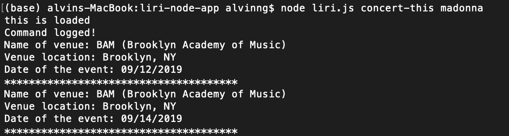

The command also handle whitespace in between names:

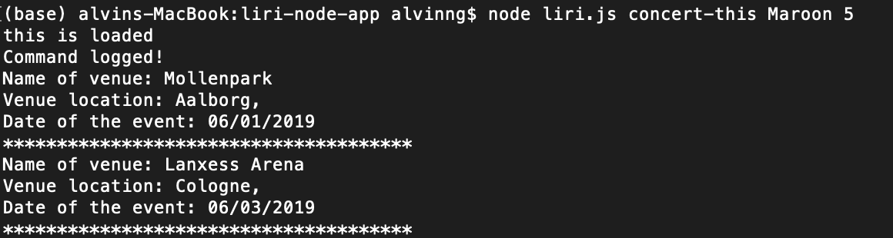

If no artist name was supplied, an error is thrown:

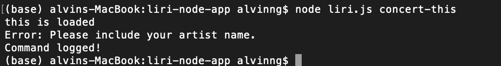

If no artist was found, an error is thrown:

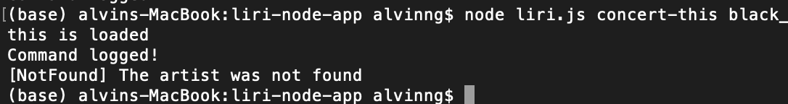

If the artist has no event:

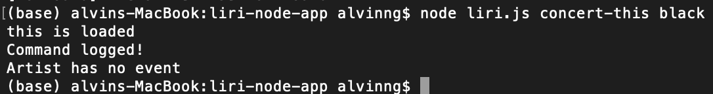

### 2. Search for song

* Note for this module to work, please supply your own spotify secret and ID in an .env file.

You can run by writing this on your terminal: 

	* `node liri.js spotify-this-song '<song name here>'`

This will return the following result:

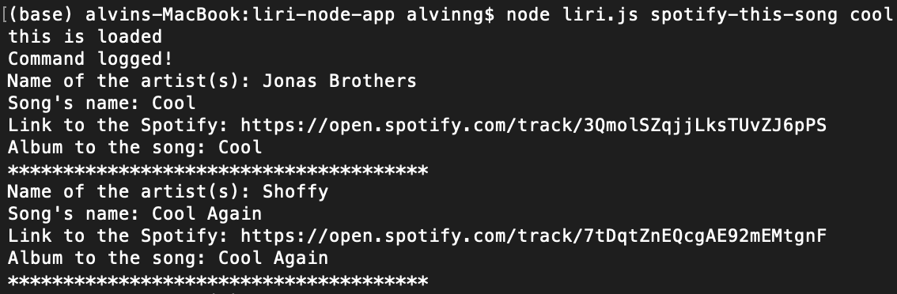

The command also handle whitespace in between names:

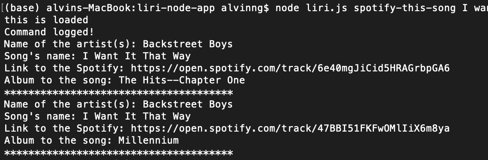

If no song name was supplied, the search result will default to "The Sign" by Ace of Base:

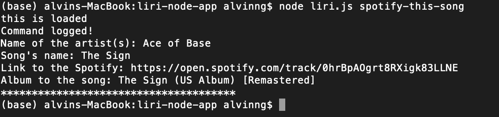

### 3. search for movie

You can run by writing this on your terminal: 

	* `node liri.js movie-this '<movie name here>'`

This will return the following result:

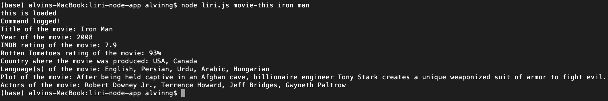
The command also handle whitespace in between names!

If no movie name was supplied, the search result will default to "Mr. Nobody":

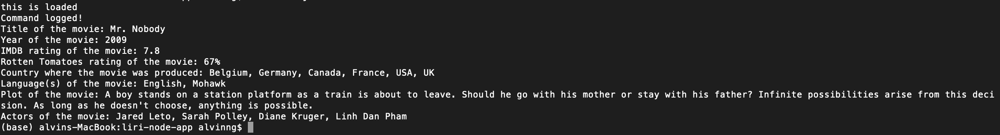

If movie does not exist, an error is thrown:

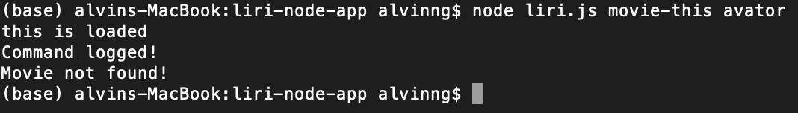

### 4. Run command from text file

You can have your command be run from a .txt file. 

* Please name the file to `random.txt`

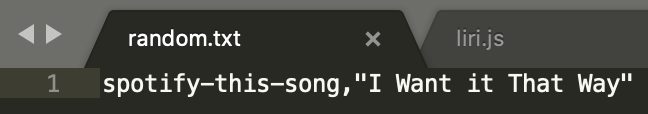
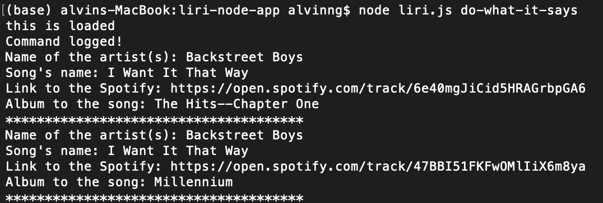